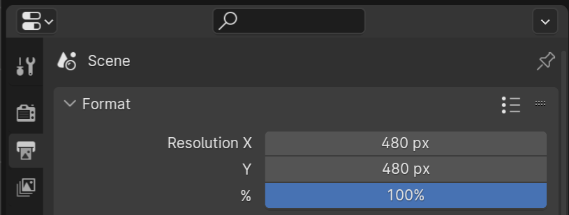
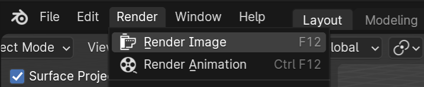

import { Steps } from '@astrojs/starlight/components';

In this article, I'll explain how to use Blender 4.0 to create renders of multiple models using Blender scripting. I'll be using [Kenney's Hexagon Kit](https://kenney.nl/assets/hexagon-kit) as the 3D assets, and rendering one image per model with one click of a button.

## Setting up

<Steps>
1. Start by opening a new Blender project and importing all the models you want to render. In my case, I imported the GLB models. 

2. Move all the models into one Collection so we can find them easily later. Rename the collection to something memorable - you will use this name later.
	:::note{icon="caution"}
	If you're using GLB models as I am in the example, your models might appear grey at this point. Don't worry - they will still appear correctly in the final render!
	:::
3. At this point, you can set up any lighting and reposition any of the models. 

4. Set up the camera.
   <Steps>
   1. Position: The easiest way I found was to position the editor view in the correct position, and then use View > Align View > Align Active Camera To View.
   
   2. Render Size: Select any object in the scene. Select the Output tab in the Properties area, and change the dimensions of the output images here.
		
		
   </Steps>
	:::tip{icon="information"}
	By default, Blender won't render images with transparent backgrounds. To set the background as transparent, select the Render tab in the Properties area, expand the 'Film' dropdown and check the 'Transparent' box.
	:::
	
5. Check the results of the render using this menu option:
	
	
	
	You may want to only render one object when testing the final result. Toggle off other objects using the camera icon in the Outliner area:
	
	

6. Once you're happy with the render result, switch to the Scripting layout using the top bar and make a new script. Make sure you save your new file with the .py extension: Blender will not do this for you automatically.

</Steps>
