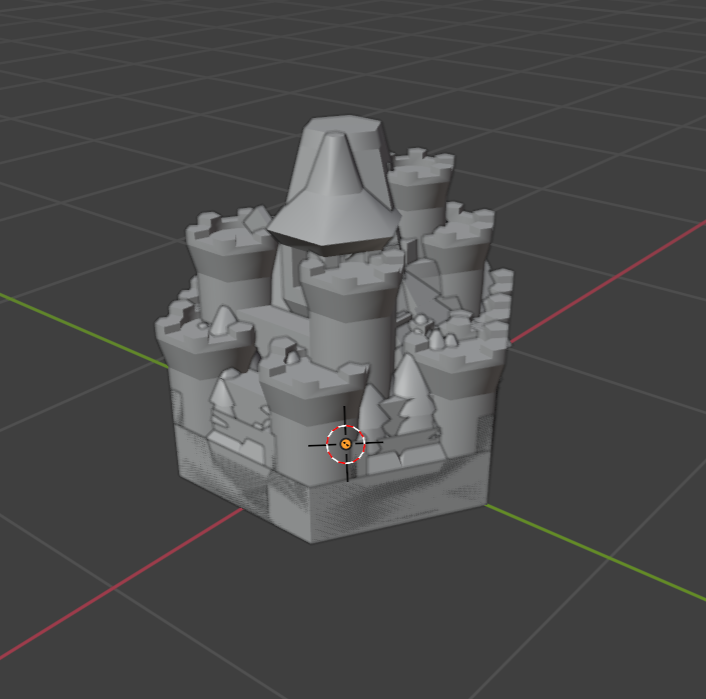
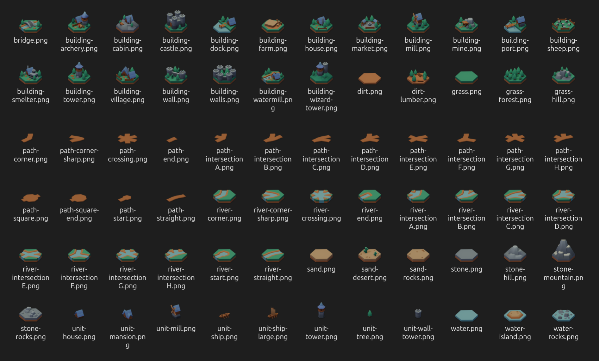

import { Steps } from '@astrojs/starlight/components';

In this article, I'll explain how to use Blender 4.0 to create renders of multiple models using Blender scripting. I'll be using [Kenney's Hexagon Kit](https://kenney.nl/assets/hexagon-kit) as the 3D assets, and rendering one image per model with one click of a button.

## Setting up

<Steps>
1. Start by opening a new Blender project and importing all the models you want to render. In my case, I imported the GLB models. 

2. Move all the models into one Collection so we can find them easily later. Rename the collection to something memorable - you will use this name later.
	:::note{icon="caution"}
	If you're using GLB models as I am in the example, your models might appear grey at this point. Don't worry - they will still appear correctly in the final render!
	:::
3. At this point, you can set up any lighting and reposition any of the models. 

4. Set up the camera.
   <Steps>
   1. Position: The easiest way I found was to position the editor view in the correct position, and then use View > Align View > Align Active Camera To View.
   
   2. Render Size: Select any object in the scene. Select the Output tab in the Properties area, and change the dimensions of the output images here.
		
		
   </Steps>
	:::tip{icon="information"}
	By default, Blender won't render images with transparent backgrounds. To set the background as transparent, select the Render tab in the Properties area, expand the 'Film' dropdown and check the 'Transparent' box.
	:::
	
5. Check the results of the render using this menu option:
	
	
	
	You may want to only render one object when testing the final result. Toggle off other objects using the camera icon in the Outliner area:
	
	

6. Once you're happy with the render result, switch to the Scripting layout using the top bar and make a new script. Make sure you save your new file with the .py extension: Blender will not do this for you automatically.
</Steps> 

## Scripting

:::caution[Read before you run this script]
- This script runs synchronously, which means that Blender's UI will freeze until the render is done. If your models are large or the renders are particularly intensive, this may take some time, and is not exitable without closing Blender.
- If you run this code multiple times, you may overwrite previous renders. There is no undo function for this, so be aware of any possible data loss.
:::

### Full Script

```python
// batch_render_models.py
import bpy, os

def set_render_self_and_children(object, show):
    object.hide_render = not show
    for child in object.children:
        child.hide_render = not show

dir_path = '/full/path/to/desired/output/directory'

objects_to_render = list(bpy.data.collections["YourCollectionNameHere"].all_objects)

for object in objects_to_render:
    set_render_self_and_children(object, True)
    
    for other in objects_to_render:
        if object == other:
            continue
        set_render_self_and_children(other, False)
    
    bpy.context.scene.render.filepath = os.path.join(dir_path, object.name + '.png')
    
    bpy.ops.render.render(animation=False, write_still=True)

```

### Breakdown

```python
import bpy, os
```
- Importing Blender's Python module, as well as the `os` module to use in file path manipulation

```python startLineNumber=3
def set_render_self_and_children(object, show):
    object.hide_render = not show
    for child in object.children:
        child.hide_render = not show
```
- Defining a function with two parameters: an object in Blender, and a bool value indicating whether it should be rendered
- Setting the object's `hide_render` value to the inverse of the `show` argument
- Iterating through the object's immediate children and setting their `hide_render` values to the same; if your models have more complex structures, you may want to modify this to iterate through more than one level of children

```python startLineNumber=10
objects_to_render = list(bpy.data.collections["YourCollectionNameHere"].all_objects)

for object in objects_to_render:
```
- Using Blender's API to access all objects in the collection created during the setup, and putting those objects into a list
- Iterating over the list; then, for each object in the list:

```python {1} startLineNumber=13
    set_render_self_and_children(object, True)
    
    for other in objects_to_render:
        if object == other:
            continue
        set_render_self_and_children(other, False)
    
    bpy.context.scene.render.filepath = os.path.join(dir_path, object.name + '.png')
    
    bpy.ops.render.render(animation=False, write_still=True)
```
- First, enabling rendering for this object using the function defined above

```python {3-6} startLineNumber=13
    set_render_self_and_children(object, True)
    
    for other in objects_to_render:
        if object == other:
            continue
        set_render_self_and_children(other, False)
    
    bpy.context.scene.render.filepath = os.path.join(dir_path, object.name + '.png')
    
    bpy.ops.render.render(animation=False, write_still=True)
```
- Turning off rendering for all objects except the one we're currently looking at. In detail:
	- Iterating over the list of objects again
	- Doing nothing if we find the object we're looking at in the outer loop
	- Otherwise, preventing the object from rendering with the function defined above

```python {8} startLineNumber=13
    set_render_self_and_children(object, True)
    
    for other in objects_to_render:
        if object == other:
            continue
        set_render_self_and_children(other, False)
    
    bpy.context.scene.render.filepath = os.path.join(dir_path, object.name + '.png')
    
    bpy.ops.render.render(animation=False, write_still=True)
```
- Setting Blender's internal render filepath value to the target directory plus the model's name and PNG extension
- Note that (unintuitively) you don't pass an output path into the render function, the output path is set here completely separately

```python {10} startLineNumber=13
    set_render_self_and_children(object, True)
    
    for other in objects_to_render:
        if object == other:
            continue
        set_render_self_and_children(other, False)
    
    bpy.context.scene.render.filepath = os.path.join(dir_path, object.name + '.png')
    
    bpy.ops.render.render(animation=False, write_still=True)
```
- Calling Blender's render function
- Ensuring that the rendering process doesn't pull data from the animation ranges in the scene by setting `animation` to `False`
- Setting `write_still` to `True` so that the render writes to an external file at the path set earlier

:::caution
The first parameter in this function is actually a positional parameter, which accepts a string value. **Do not set this value unless you know what you're doing!** It will cause the render to run asynchronously, which means that Blender's internal file path value will be overwritten when we set it in later iterations. For me, this caused only the last image to actually be output at the end. I believe that each render did happen, but just wrote it to the same path.

Running this code synchronously is the reason that Blender's UI will freeze until the render is done. As mentioned above, if your models are large or the renders are particularly intensive, this may take some time, and is not exitable without closing Blender.
:::

## Example Results

&nbsp;

<div style={{ "margin": "auto", "width": "60%" }}>

</div>
<p style={{ "text-align": "center", "font-size": "0.9em"  }}>*Before*</p>


<p style={{ "text-align": "center", "font-size": "0.9em" }}>*After*</p>
